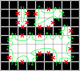

## Codebase

The code is still in development so there's lots of superfluous function and
TODO left around. Hopefully this page will give a better idea of how things work
until I can clean things up.

I'm also trying a new IDE, IntelliJ IDEA, and I'm guessing I've added too many
files to the repo.

## Data Structure Basics

The basic data structure is a kind of like
a [winged edge data structure](https://en.wikipedia.org/wiki/Doubly_connected_edge_list).
Each `Tile` represents a single square in the final net or on the cuboid.
Each `Tile` has 4 `TileLink`. These `TileLink` have pointers to the `Tile`
they're part of, their orientation in that `Tile`. They also have a pointer to
the `TileLink` of the adjacent `Tile` which they're "glued" to. The `Cuboid`
class builds a set of `Tile` and glues the `TileLink` together to have the
proper shape. When a search is started, a `Cuboid` of each size is made.
Additionally, a flat 2D array of `Tile` is generated to hold the flat version of
the net. The flat net uses the `Face` class and is oversized to allow the net to
grow in any direction. It wraps like a torus to save being massively oversized.
These structures act as the skeleton/backbone of the search.

#### Future work

The `TileLink` could just be an `int` indexed into a block of `int[]` pointing
to their glued counterpart. You can find the `Tile` just by `index>>2` so the
other `TileLink` on the same `Tile` are nearby and easily computable. Using
this `int` representation should be a lot faster than following object pointers
around like I am now. And it should be nice to have a contiguous block of memory
that can fit in cache.

## The Search

### Depth First Search

The search is basically a depth first search. At each step, it tries to add
a `Tile` in every legal position. After trying one position, that move is banned
in all future searches to prevent the other children from attempting it and
duplicating work.

Again to prevent duplicate work, when banning a move after a failed attempt, we
need to ban all moves that would effectively use that same move. To allow hidden
cuts in the flat version of the net, we only do this second banning if the
additional move would land on the same tile on all cuboids.

When a `Tile` is added to a search node, it is simultaneously add on all cuboids
at once (and the flat version). To keep track of this, I use a `MetaTileLink`
that has an array of `TileLink`. This way, every move I make on one cuboid, I
can make the exact corresponding move on all cuboids relative to the net I'm
building.

If while exploring, a newly added `Tile` is adjacent to an old `Tile` on one
cuboid, we can ban the 2 `MetaTileLink` that would hypothetically join them
across that cuboid.

### The Seeds

The starting points for each search will be a set of `Tile` from every cuboid.
Every possible combination of starting `Tile` will be tested. If a cuboid has
extra symmetries, we can ignore many of the possible starting tiles. On one of
the cuboids with the least symmetries, we can pick only 1 tile as it's root node
to prevent finding N copies of each net where N = number of tiles.

- 46 tiles - 1058 roots
    - 1x1x11 - 23 roots
    - 1x2x7 - 46 roots (reduced to 1)
    - 1x3x5 - 46 roots
- 54 tiles - 243 roots
    - 1x1x13 - 27 roots
    - 1x3x6 - 54 roots (reduced to 1)
    - 3x3x3 - 9 roots

I know I'm not explaining this part super well, sorry, but it's clear in my
head... and I'm bad at finding the words to explain it. I think this is kind of
obvious.

#### Future work

When I reduce one cuboid to 1, I think it might be important which 1 sample
point I choose. Like, maybe being near a corner is harder or easier to play well
other cuboids.

### More Pruning

Earlier, I said that at each step we try to add a `Tile` at every legal
position. Sometimes however, we can do better and test less than half of them.
Often a net grows so that the remaining uncovered portion is subdivided into
multiple regions. If we can't fill one of these subregions, we clearly won't be
able to cover the entire cuboid.

So, at a given node in our search tree, we only need to branch and explore the
inlets of a single loop, preferably the smallest one for a smaller branching
factor. Once the enclosed area is filled in at a deeper node in the search tree,
the search can move on to other enclosed areas.

"Smallest" enclosed area could be measured a few different ways. I've elected to
use non-banned perimeter as my metric. This is because it's fairly easy to
calculate and is probably faster/cheaper than doing a flood-fill. If we imagine
walking and leaving an inlet into the area, you just follow a right-hand rule
like you're solving a maze the brute force way. This will lead you to another
inlet. Repeat until you get back to the inlet you started on and you've
identified a loop.

#### Mutliple Cuboids

Because each cuboid wraps differently, we might have only 1 loop on one, while
having multiple loops on another. For the best result we'll need to find the
smallest loop on all cuboid and only search it.

#### Future work

- I'm currently recalculating the smallest loop at every step of the DFS. It
  should be possible save these results and infer the new loop sizes just by
  calculating the deltas with each added tile.
- I'd like to try measuring each loops area instead of perimeter. My gut says
  these things are already highly correlated, but I want to know if they're not.
  And I think by sorting by area, it'll stay with the more consistently smaller
  loop because perimeter can actually go up as you add `Tile`. The big downside
  is that using flood-fill to measure area would be computationally much more
  expensive than just walking the perimeter. But these tile counts are kind of
  small, maybe it won't be as bad as I think.
- If we do measure loops by area, we could potentially leverage this for huge
  gains. If we know that a loop has area N, we know that N `Tile` must be
  connected to all the inlets. Let say cuboid1 has a loop of area N. If the
  inlets to this loop surround a loop of area != N on cuboid2, we can quit this
  search branch because it will be impossible to satisfy both loops. Even if two
  loops on different cuboids don't have the exact same inlets, you can deduce
  some things about how many `Tile` connect to each inlet based all the loops
  it's part of.
- Given all the benefits of multiple loops, if we have only 1 loop, we should
  try and direct the search to pinch it in half to have multiple loops. I have
  no idea how to do this. Also, since we're doing an exhaustive search,
  prioritizing one direction first doesn't really have many benefits.

### Duplicate Results

Some nets can wrap a cuboid multiple different ways. This leads to nets having
to put into a canonical form, so they can be compared. On the 22 tile - 2 cuboid
problem, my algorithm finds 18508 solutions, but after de-duplication there is
only 2290. I use the `DenseFlatNet` class for this.

### Multithreading

I haven't added multithreading yet, but I plan to, soon. Multithreading can very
naturally be spread out across each seed state. But to share the load better
across multiple computer I need to implement saving states in the middle of the
search and updating a workload scheduler with a list of unexplored children of a
search.

## Some graphs I wanted to share

This is the number of states at each depth of a search for a couple different
searches. The 22/30 tile searchs are complete, while the counts for the 46 tile
search is only about 3% complete. Ignore the funny upswing at the end of the
first two. It's a quirk of my exploration not counting states that have only 1
legal move.

